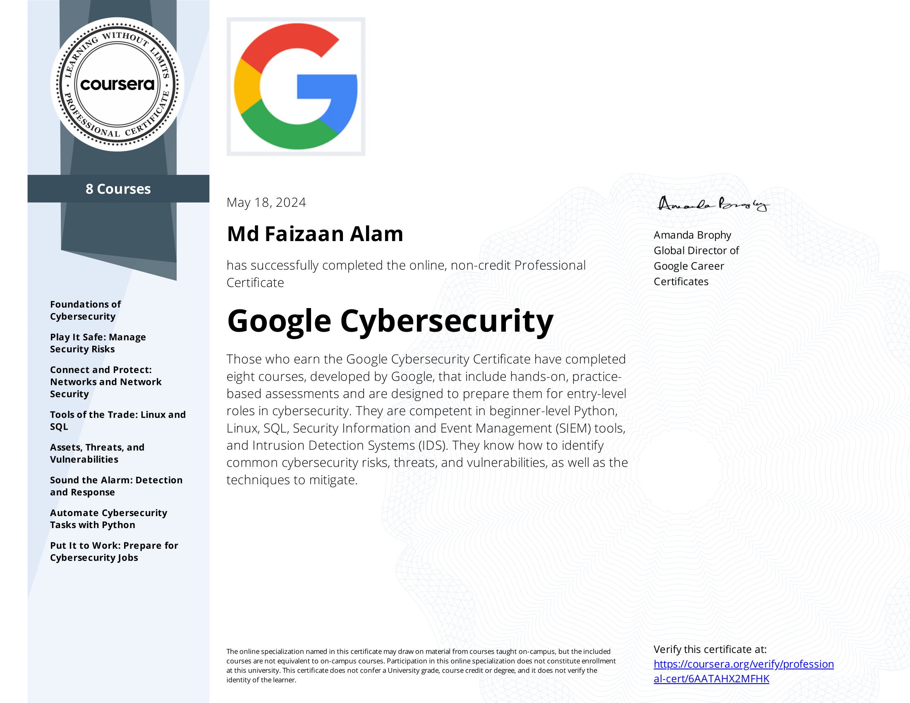

# Google Cybersecurity Professional Certificate

This repo holds all of the projects, notes, and write-ups I have done while completing the [Google Cybersecurity Professional Certificate](https://grow.google/certificates/cybersecurity/#?modal_active=none).

You can view my certificate of completion on [Credly](https://www.credly.com/badges/48edbffc-bbba-47f0-90c7-609084b338d5/public_url) or [Coursera](https://coursera.org/share/1ebb40ac0d5729bd12c39d8230168cc8).

Glossary related to this certification course [Gloosary](https://docs.google.com/document/d/1Feb8pHRY-blnpaLOohds2esd6IWdCIp-ikG7G_omSj4/template/preview?resourcekey=0-YHcAISkCiqGDq5KwO6yNeQ)

In this course I gained foundational knowledge that will prepare me for entry-level jobs in cybersecurity and help me understand how security teams protect their organizations and its customers. 

This course covered many conceptual topics such as:
  * Risk management
  * Threat analysis
  * Network security
  * Incident response

It also taught me technical skills with:
  * Linux
  * Python
  * SQL
  * SIEM tools (Splunk and Chronicle)
  * Network protocol analyzers (Wireshark and tcpdump)
  * IDS/IPS tools
  * Firewalls

Each directory holds the files for each of the courses in the certificate and the order they were completed in is: 
  1. Foundations of Cybersecurity
  2. Play It Safe: Manage Security Risks
  3. Connect and Protect: Networks and Network Security
  4. Tools of the Trade: Linux and SQL
  5. Assets, Threats, and Vulnerabilities
  6. Sound the Alarm: Detection and Response
  7. Automate Cybersecurity Tasks with Python
  8. Put It to Work: Prepare for Cybersecurity Jobs (No files needed)
